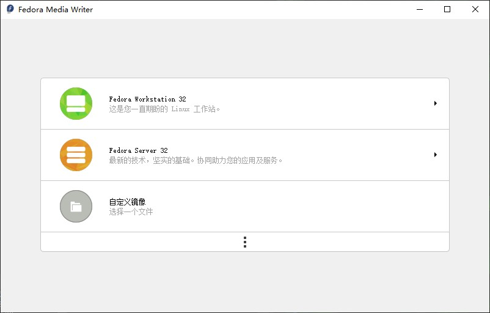
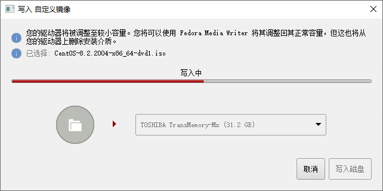

# Install CentOS

最近准备搭建一个 Homelab，用来方便生活&方便学习。在考虑购入合适硬件的同时，不妨用手头更新换代闲置的旧 PC 来先做一下尝试。我的旧 PC 当年配置尚可，相信现在还是可以胜任一个入门 Homelab 来耍耍。

首先在闲置 PC 上安装 CentOS 系统，同时移除不再使用的 Windows 系统。

## 下载 CentOS 系统镜像

从 CentOS 官网下载最新的系统镜像文件。

https://www.centos.org/download/

选择想安装的系统版本，选择合适的 mirror 链接下载，阿里云的就不错。在下载 ISO 文件时注意选择 DVD1 ISO，这个版本还包括一些方便的 packages 可以顺便安装，建议大部分用户选择。（[为什么？点我查看](https://docs.centos.org/en-US/8-docs/standard-install/assembly_preparing-for-your-installation/#downloading-beta-installation-images_preparing-for-your-installation)）

这里我选择的是 CentOS-8.2.2004。文件大小 8G，不过 mirror 站网速不错，下载只用了几分钟时间。

## 将系统镜像写入 U 盘

准备一个至少 16G 的 U 盘，将 CentOS 系统 ISO 文件写入其中，制作成一个装机盘。这需要一个刻录工具，如果你没有合适的刻录工具，在 Windows 平台，官方推荐 [Fedora Media Writer](https://github.com/FedoraQt/MediaWriter/releases) 来完成装机 U 盘的制作。

刚好我没有一个合适的刻录工具 😂，而且 U 盘只能在 Windows 下被识别，所以尝试了一下 Fedora Media Writer。步骤属于傻瓜操作。

- 下载 Win 平台 Fedora Media Writer 安装程序并进行安装

> https://github.com/FedoraQt/MediaWriter/releases

- 启动 Fedora Media Writer 选择 [自定义镜像]



- 在弹出框中找到上面下载的 CentOS 系统镜像，我这里是 `CentOS-8.2.2004-x86_64-dvd1.iso`
- 在接下来的菜单中选择插入的 U 盘，点击 [写入磁盘] 开始刻录



等待一会，刻录完成即可开始安装系统。

## 安装 CentOS 系统

将 U 盘插入闲置 PC，开机进入 BIOS，选择 USB Storage Device 启动。不出意外的话，将正常进行 CentOS 系统的安装。

安装界面是一个 GUI，可以根据需求定制一下安装过程。

**移除旧 Windows 系统**

操作前请先做好数据备份（如果有关键数据的话）。CentOS 选择挂载硬盘时，选择对硬盘进行 reclaim，清除所有数据。这样，旧 Windows 系统将直接被删除。

由于只是一次尝试，安装过程就基本按照默认设置来了，在 GUI 界面可以设置一下 WIFI 链接，方便后面操作。当然掠过也无所谓，可以使用 `nmuti` 进行配置。

Homelab 不需要一个 GUI，所以在安装选项上我选择了不带 GUI 的 server。

总结一下，主要配置完下面的内容，就可以进入安装阶段了。

- 安装内容（server without GUI）
- 挂载硬盘（reclaim 所有空间进行 clean 安装）
- 语言和时间设置

安装阶段可以对 root 用户设置密码。然后，稍等片刻，安装很快就会结束。

## 链接 WIFI

先准备一根网线，连接机器和路由器，保证网络。

对我来说始终连接网线不太方便，我的机器存在无线网卡，所以决定出于方便这台实验性质的 Homelab 就使用 WIFI 联网。

CentOS 的 WIFI 并非开箱即用，所以我们需要先保证网络。网络畅通的情况下输入下面的命令安装 WIFI 组件。

```shell
$ sudo yum install NetworkManager-wifi
```

安装完成后 `reboot` 一次，拔掉网线，WIFI 将会自动连接。

到此 CentOS 的安装已经完成了。
